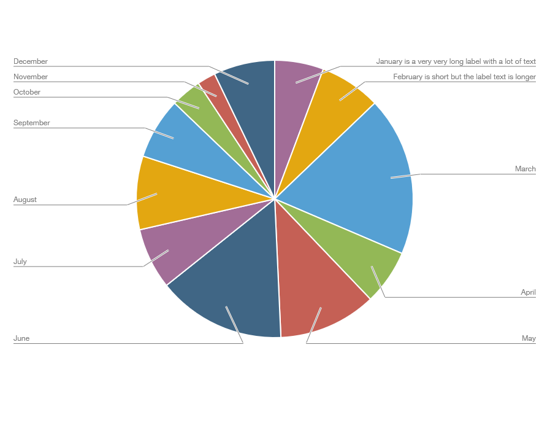

# ChartLineLabelPlugin

This is a little javascript demo to label segments of a pie chart with anchor lines based on the popular Chart.js library.

[ChartLineLabelPlugin anchored labels with legend](images/default.png)

## Usage

The plugin is not a 'real' npm plugin yet. You can just copy the code into your javascript code and add the plugin to your chart's plugin list:

```javascript
const config = {
      type: 'pie',
      data: data,
      options: options,
      plugins: [chartLineLabelPlugin, ...]
    };
```

## Properties

There are several properties you can set to change the appearance of the labels.

```javascript
 const options = {
   ...
   plugins: {
      chartLineLabelPlugin: {
         labelSpace: 120,
         lineHeightFactor: 1.2,
         anchorCenterPercent: 100,
         font: "12px 'Helvetica Neue', 'Helvetica', 'Arial', sans-serif",
         color: 'gray',
         edgePadding: 25,
         halo: true,
         alignLabels: false,
         showDebugInfos: false
   },
   ...
};
```

### labelSpace and labelSpacePercent

The `labelSpace` defines padding left and right in pixel or in percent of the total width (`labelSpacePercent`).

<div style="float: left; text-align:center;"><br/><b>labelSpace: 50</b></div>
<div style="text-align:center;"><br/><b>labelSpace: 200</b></div>

### lineHeightFactor

The `lineHeightFactor` defines the height. A `lineHeightFactor` of 1 means that each line is the same height as the font size.
<div style="float: left; text-align:center;"><br/><b>lineHeightFactor: 1</b></div>
<div style="text-align:center;"><br/><b>lineHeightFactor: 2</b></div>

### anchorCenterPercent

The `anchorCenterPercent` defines the position of the inner point of the anchor line. 100 is exactly on the circle border while 0 is the center of the circle. 50 is therefore right in the middle of each pie arc.

<div style="float: left; text-align:center;"><br/><b>anchorCenterPercent: 50</b></div>
<div style="text-align:center;"><br/><b>anchorCenterPercent: 25</b></div>

### font

Defines the font family and size.

### color

The color of the text and the anchor lines.

<div style="text-align:center;"><br/><b>color: darkred</b></div>

### edgePadding

Distance of the anchor line breaking point to the border of the circle.

<div style="float: left; text-align:center;"><br/><b>edgePadding: 0</b></div>
<div style="text-align:center;"><br/><b>edgePadding: 55</b></div>

### halo

Is `true`, when a white halo line should be drawn for better visual differentiation of the anchor lines.

<div style="text-align:center;"><br/><b>halo: false</b></div>


### alignLabels

The labels can all be aligned at the left/right edge of the diagram (`alignLabels = true`) or at the nearer distance to the circle, depending on the text length (`alignLabels = false`).


<div style="float: left; text-align:center;"><br/><b>alignLabels: false</b></div>
<div style="text-align:center;"><br/><b>alignLabels: true</b></div>

### showDebugInfos

If this is set `true` there are additional infos like the line numbers are shown for debug purposes.
